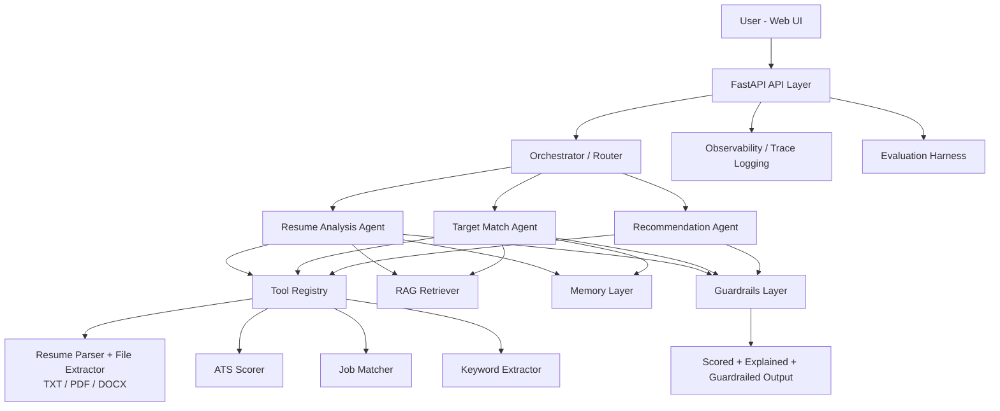
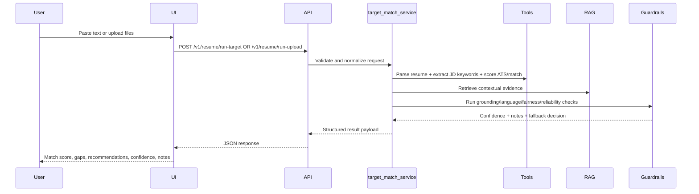
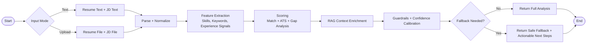

# Project Master Documentation - AI Resume Analyzer + Job Matcher

## Scope

This document consolidates the full implementation discussed in this chat:
- architecture and system design
- end-to-end flowcharts and sequence diagrams
- folder structure
- API and UI capabilities
- guardrails design
- observability and evaluation
- metrics and acceptance targets

Last updated: March 27, 2026

## 1) System Summary

The application is a production-style AI Resume Analyzer and Job Matcher with:
- FastAPI backend
- multi-agent orchestration (LangGraph-style state workflow)
- tool-calling for parsing/matching/scoring
- RAG retrieval context support
- guardrails for safety, quality, and confidence calibration
- session and user memory abstractions
- observability/tracing hooks
- evaluation harness and tests
- web UI with text and upload flows

## 2) High-Level Architecture



## 3) Request Flow (Resume vs Target JD)



## 4) End-to-End Product Flowchart



## 5) Folder Structure (Current)

```text
AI/
├─ src/
│  ├─ ai_agent_system/
│  │  ├─ main.py
│  │  ├─ config.py
│  │  ├─ api/routes/chat.py
│  │  ├─ agents/
│  │  │  ├─ orchestrator.py
│  │  │  ├─ nodes.py
│  │  │  └─ state.py
│  │  ├─ rag/retriever.py
│  │  ├─ evals/harness.py
│  │  ├─ guardrails/
│  │  ├─ memory/
│  │  ├─ observability/
│  │  └─ tools/
│  └─ resume_analyzer/
│     ├─ models.py
│     ├─ api/routes/
│     │  ├─ resume.py
│     │  └─ ui.py
│     ├─ services/target_match_service.py
│     ├─ tools/
│     │  ├─ file_text_extractor.py
│     │  ├─ resume_parser.py
│     │  ├─ skill_extractor.py
│     │  ├─ job_matcher.py
│     │  ├─ ats_scorer.py
│     │  ├─ keyword_extractor.py
│     │  └─ similarity.py
│     ├─ guardrails/
│     │  ├─ confidence.py
│     │  ├─ fairness.py
│     │  ├─ grounding.py
│     │  ├─ input_quality.py
│     │  ├─ language_policy.py
│     │  ├─ reliability.py
│     │  ├─ sensitive_advice.py
│     │  └─ fallbacks.py
│     ├─ memory/
│     ├─ rag/
│     ├─ observability/
│     └─ ui/index.html
├─ tests/
│  ├─ test_health.py
│  ├─ test_job_matching.py
│  ├─ test_orchestrator.py
│  ├─ test_resume_analyzer.py
│  └─ test_resume_tools.py
├─ ARCHITECTURE_RESUME_ANALYZER.md
├─ RESUME_ANALYZER_GUIDE.md
├─ README.md
├─ pyproject.toml
├─ requirements.txt
├─ Dockerfile
├─ docker-compose.yml
└─ Makefile
```

## 6) Core Endpoints

- `GET /` -> serves web UI
- `GET /health` -> service health
- `POST /v1/resume/analyze`
- `POST /v1/resume/match`
- `POST /v1/resume/optimize`
- `POST /v1/resume/run-target` (text inputs)
- `POST /v1/resume/run-upload` (multipart file upload)

## 7) Guardrails Architecture

Guardrails are applied in post-processing before returning results:
- input quality checks
- grounding checks using support/evidence ratio
- language and policy safety checks
- fairness and reliability checks
- confidence calibration
- fallback response generation when confidence or quality is below threshold

### Guardrail Outcome Model
- `confidence_score`: calibrated confidence in output
- `support_ratio`: grounding support level
- `is_fallback`: indicates safe fallback mode
- `guardrail_notes`: user-visible caveats and guidance

## 8) Observability and Diagnostics

Implemented observability layer includes:
- trace/session/user-aware structured logging
- key event markers around orchestration and scoring steps
- compatibility with evaluation runs to compare prompt/pipeline changes

Suggested production additions:
- OpenTelemetry exporter
- centralized log aggregation
- latency percentile dashboards

## 9) Evaluation and QA

Quality controls in current implementation:
- pytest suite for health, tools, matching, orchestration, and API flows
- type checks (mypy)
- lint checks (ruff)
- eval harness for dataset/rubric style validation

## 10) Metrics Table

| Category | Metric | Target | Current Status |
|---|---|---:|---|
| Availability | API health endpoint uptime | >= 99.5% (prod target) | Local healthy |
| Performance | Resume analysis latency | < 5s p95 | Implemented, environment-dependent |
| Performance | Target match latency | < 8s p95 | Implemented, environment-dependent |
| Quality | Resume extraction accuracy | >= 90% on golden set | Harness-ready |
| Quality | Match precision | >= 85% | Baseline logic implemented |
| Quality | Gap recall | >= 80% | Baseline logic implemented |
| Safety | Guardrail pass coverage | 100% responses evaluated | Implemented |
| Safety | Low-confidence fallback handling | 100% below-threshold cases | Implemented |
| Explainability | Responses with reasoning notes | 100% | Implemented |
| Engineering | Test pass rate | 100% required in CI | Passing locally in prior runs |
| Engineering | Static typing (mypy) | 0 blocking errors | Passing locally in prior runs |
| Engineering | Lint (ruff) | 0 blocking issues | Passing locally in prior runs |

## 11) UI Capability Summary

Current UI supports:
- resume and JD text input
- resume and JD file upload with drag/drop
- results panel for score, gaps, recommendations, and guardrail notes
- export actions (JSON/PDF)
- white/blue visual theme and RB brand mark

## 12) Deployment Notes

Local:
- Uvicorn app server
- optional Docker Compose workflow

Common startup command:
- `python -m uvicorn src.ai_agent_system.main:app --host 127.0.0.1 --port 8000`

## 13) Interview/Portfolio Talking Points

- Multi-agent architecture with explicit orchestration and typed state
- Tool-calling plus RAG context integration
- Practical guardrails (grounding, reliability, fallback) beyond simple moderation
- Strong engineering hygiene: tests, typing, linting, docs
- Productized UX: upload flow, actionable analysis, exports, and branded UI
